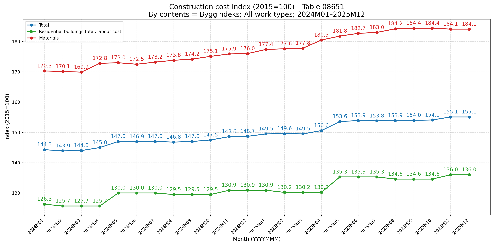
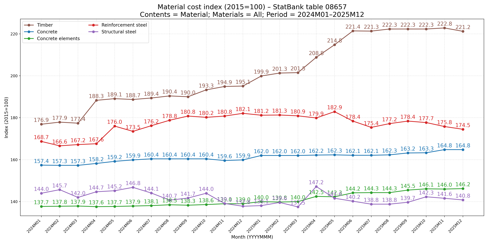
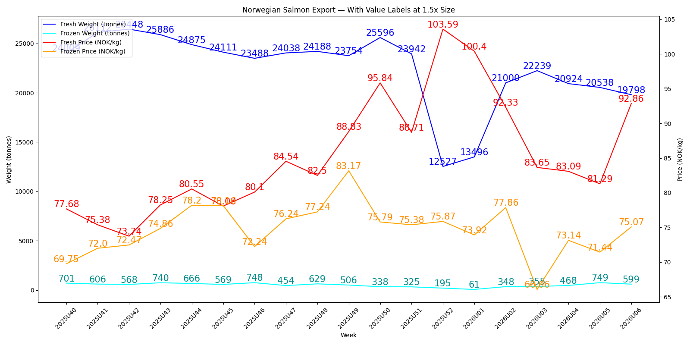

# How It Works

This document explains how the Norway Statistics Agent operates within Microsoft Teams and Microsoft 365 Copilot Chat to help you locate and import tables from Statistics Norway (SSB).

## Interaction flow
- Mention the agent in a Copilot chat (e.g., `@Norway Statistics Agent`).
- Ask to search tables by topic/keywords. The agent queries SSB PX-Web endpoints and returns matching table IDs with short descriptions.
- Request parameters for a specific table ID to discover available fields and values.
- Ask the agent to import data from that table, providing filters for parameters.
  - If a parameter is not provided, the agent uses `*` (all values) for that parameter.
- The agent returns data formatted as an HTML table in the chat.

## Best practice for analysis
1. Use the agent to find the right table and retrieve parameters.
2. Import a focused dataset by specifying filters to keep result sizes manageable.
3. Switch off the agent (click the X next to the agent) once the import is complete.
4. Continue analysis with core Copilot features (e.g., create dataframes, run Python for charts/analysis, export files, or collaborate with other agents).

## Limits and constraints
- Some SSB tables are too large to download in full due to size and platform constraints.
- The SSB API and Copilot may impose rate limits or practical limits on response sizes.
- Availability, functionality, and maintenance of the agent are not guaranteed; this is a free test offering.

## Example output
- See [Report](Report/) for a sample analysis exported from a chat, including diagrams, analysis, and forecast.

## Visual Examples
Here are a few sample visuals to set expectations about the types of outputs you might work with after importing data:

